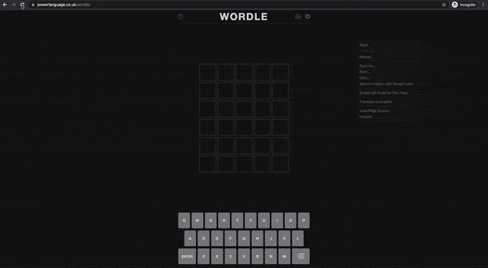

Title: Wordle One Shot Solution (Hack)
Date: 2022-01-13 10:20
Category: posts
Tags: hacks, web-technolgy
Slug: wordle-hack
Authors: Shubhanshu Mishra
Summary: Wordle One Shot Solution (Hack)




**NOTE: This is a hack to get the wordle solution**

**NOTE: Use it only when you are frustrated and just want to see the solution. It will ruin the fun of the game for you.**

I am not doing anything fancy. It is just that the solution is always available on the page and I am reading it and firing the keypresses to get answer.

> Be reminded that **you should not copy JS from strangers on your pages, it can be used to steal your passwords or other sensitive information**. You can read the full code used here and more details at: https://gist.github.com/napsternxg/a80021d6aec9d362db8c736bc2f9a888. Learn about internet security from A PROJECT OF THE ELECTRONIC FRONTIER FOUNDATION: SURVEILLANCE SELF-DEFENSE: TIPS, TOOLS AND HOW-TOS FOR SAFER ONLINE COMMUNICATIONS course from https://ssd.eff.org/en


## How to use
Make a bookmark with the following URL. When on the wordle page. Click the bookmark to get solution. 
```js
javascript:function act(e){window.dispatchEvent(new KeyboardEvent("keydown",e))}const done={code:"Enter",key:"Enter",charCode:13,keyCode:13,view:window,bubbles:!0},solution=JSON.parse(window.localStorage.gameState).solution;Array.from(solution).map(e=>act({key:e})),act(done);const warn_message="This is a hack to get the wordle solution.\nWhen your press OK the solution will show. Read the message below in full.\nNOTE: Use it only when you are frustrated and just want to see the solution. It will ruin the fun of the game for you. \nI am not doing anything fancy. \nIt is just that the solution is always available on the page and I am reading it and firing the keypresses to get answer.\nYou can simply right click the page and open the console and type this JS. Be reminded that you should not copy JS from strangers on your pages, it can be used to steal your passwords or other sensitive information. You can read the full code used here and more details at: https://shubhanshu.com/blog/wordle-hack\nLearn about internet security from A PROJECT OF THE ELECTRONIC FRONTIER FOUNDATION: SURVEILLANCE SELF-DEFENSE: TIPS, TOOLS AND HOW-TOS FOR SAFER ONLINE COMMUNICATIONS course from https://ssd.eff.org/en\n";alert(warn_message);
```

<div>
<style>
.bookmark-btn {
  background-color: #199319;
  color: white;
  padding: 15px 25px;
  text-decoration: none;
  margin: 10px;
}
</style>
<a class="bookmark-btn" href='javascript:function act(e){window.dispatchEvent(new KeyboardEvent("keydown",e))}const done={code:"Enter",key:"Enter",charCode:13,keyCode:13,view:window,bubbles:!0},solution=JSON.parse(window.localStorage.gameState).solution;Array.from(solution).map(e=>act({key:e})),act(done);const warn_message="This is a hack to get the wordle solution.\nWhen your press OK the solution will show. Read the message below in full.\nNOTE: Use it only when you are frustrated and just want to see the solution. It will ruin the fun of the game for you. \nI am not doing anything fancy. \nIt is just that the solution is always available on the page and I am reading it and firing the keypresses to get answer.\nYou can simply right click the page and open the console and type this JS. Be reminded that you should not copy JS from strangers on your pages, it can be used to steal your passwords or other sensitive information. You can read the full code used here and more details at: https://shubhanshu.com/blog/wordle-hack\nLearn about internet security from A PROJECT OF THE ELECTRONIC FRONTIER FOUNDATION: SURVEILLANCE SELF-DEFENSE: TIPS, TOOLS AND HOW-TOS FOR SAFER ONLINE COMMUNICATIONS course from https://ssd.eff.org/en\n";alert(warn_message);'>Wordle Solve Bookmark (Drag me to bookmark bar)</a>
</div>


## Code

You can simply right click the page and open the console and type this JS. Be reminded that you should not copy JS from strangers on your pages, it can be used to steal your passwords or other sensitive information. You can read the full code used here and more details at: 


Detailed code is as follows:


```js

/*
This is a hack to get the wordle solution

NOTE: Use it only when you are frustrated and just want to see the solution. It will ruin the fun of the game for you. 

I am not doing anything fancy. 
It is just that the solution is always available on the page and I am reading it and firing the keypresses to get answer.

You can simply right click the page and open the console and type this JS. Be reminded that you should not copy JS from strangers on your pages, it can be used to steal your passwords or other sensitive information. You can read the full code used here and more details at: 

More details on code at: https://shubhanshu.com/blog/wordle-hack
*/

/*
Helper function to fire keypress.
*/
function act(x){
  window.dispatchEvent(new KeyboardEvent('keydown', x));
}; 
/* Keypress arguments to simulate Enter key press */
const done = {code: 'Enter',key: 'Enter', charCode: 13, keyCode: 13, view: window, bubbles: true};
/* Wordle Solution is always saved in localStorage so just retriving it from there. */
const solution = JSON.parse(window.localStorage.gameState).solution;
/* Fire keypress for each char in the solution and then press Enter. */
Array.from(solution).map(x => act({key: x})); act(done);
/* Display warning message on running JS from strangers on your page. Good way to educate masses on perils of copy pasting JS on secure pages (hopefully). */
const warn_message=`This is a hack to get the wordle solution.
When your press OK the solution will show. Read the message below in full.
NOTE: Use it only when you are frustrated and just want to see the solution. It will ruin the fun of the game for you. 
I am not doing anything fancy. 
It is just that the solution is always available on the page and I am reading it and firing the keypresses to get answer.
You can simply right click the page and open the console and type this JS. Be reminded that you should not copy JS from strangers on your pages, it can be used to steal your passwords or other sensitive information. You can read the full code used here and more details at: https://shubhanshu.com/blog/wordle-hack
Learn about internet security from A PROJECT OF THE ELECTRONIC FRONTIER FOUNDATION: SURVEILLANCE SELF-DEFENSE: TIPS, TOOLS AND HOW-TOS FOR SAFER ONLINE COMMUNICATIONS course from https://ssd.eff.org/en
`;
alert(warn_message);
```